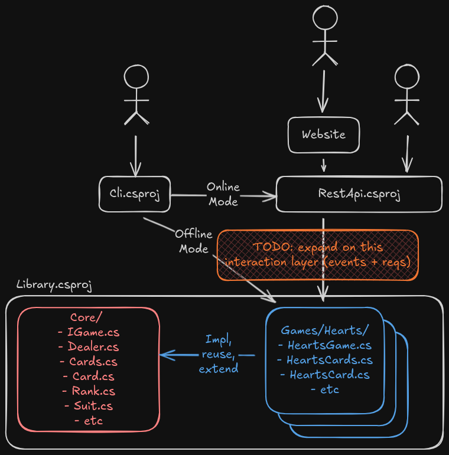

# CoolCardGames

This repository implements a number of card games.

## Getting Started

### Architecture

This uses abstract core architecture. Within `Library.csproj`, there is `Core/`, which contains
reusable classes (like `Dealer`), interfaces/abstract classes (likes `IGame`), and classes that can
be extended or left as-is (like `Card` and `Cards`).

Here is the ***planned*** architecture (we'll see how long it takes for me to lose interest):

### Build and Test

`dotnet build`

`dotnet test`

## TODO

Here's the [prototype repo](https://github.com/sawyerwatts/CardGamesPrototype)).

### Short-Term

- Checklists the types migrated from prototype
- See Improvement Ideas from Prototype
- make `IGame`
- Reimplement `HeartsGame`
- Make CLI entrypoint (offline only, for now)
- Update architecture diagram to better detail interactions (and setup?)

#### Improvement Ideas from Prototype

1. Pushing events for each game action seems like a good idea. That way, different players can be
   notified of changes and handle rendering of changes to their player's UI, and it'd be helpful for
   a card counting feature.
    - A `Players : List<Player>` mediator could be beneficial for this reason, especially because
      when needing to ask all players for card(s) in parallel.
2. When prompting for card(s), having more human-readable and computer-readable details (esp
   rejection details) would be helpful.
3. The current division between `Player` and `IPlayerInterface` is awkward since the player only
   knows what cards they have when they are prompted to play something. See the next item for more.
4. Game state needs a pass, especially in regards to visibility. In Hearts, a player can know any
   other player's score whenever, and in other games, a player can know how many cards another
   player has, but seeing the hand is not allowed. Going one step further, no players can look at
   the contents of taken tricks (except the last, if you're feeling kind).
    - Make `GameState` and `PlayerState` w/ visibility modifiers on all properties so everyone can
      see everything
    - Diff levels of visibility:
        - Public: total score, number of cards in a player's hand, number of tricks a player has
          taken, etc
        - Private (to owning player): contents of hand, card counting tracker
        - Hidden (from all players): contents of played tricks
    - Merge `IPlayerInterface` into `Player`, and inject `GameState` and this player's
      `PlayerState` (or index w/in `GameState.Players`)
    - Implement:
        - `HeartsGameState : GameState`
        - `HeartsPlayerState : PlayerState`
        - `CliPlayer : Player`
        - `AiPlayer : Player`
    - For (1), have message channels for each player that the implementations can consume as a part
      of rendering updates, like if got disconnected and needed to replay?
    - Altho a god state object could have weird mutators causing bugs. Have the game state be
      immutable or otherwise lock down mutations to specific classes? This might be too much tho
5. As a combo of previous ideas, have a `GameState` and a `ReadonlyGameState` for players (that also
   applies the appropriate data authorization filtering)?

### Other Platforms and Online Mode

- Online mode
    - REST API, maybe [grpc?](https://github.com/grpc/grpc-dotnet)
    - P2P or Server?
    - [Rollback?](https://en.wikipedia.org/wiki/Netcode#Rollback)
    - How handle reconnects? Sticky session, probably
- CLI Online Mode
- Website
- Mobile App, esp w/ offline mode too (LOL)
- Desktop App, esp w/ offline mode too (LOL)

### Other Ideas

- Have a debug mode that lets you see all the other hands and step through running each?
- Meaningful game AI
    - Would need card counting, esp to track when a player runs out of a suit
- Save mid-game
- Seeds and replayability
- Lobbies, queues, chat, notes, passwords, accounts
- Track player stats
- Sufficient logging such that games can be replayed

### Other Card Games to Implement

- Spades
- Rummy
- Chimera (altho this one isn't public domain, so prob just look into the games its based off, ichu,
  The Great Dalmuti, Big Two, and Beat the Landlord)
- Dingbat
- Bridge
- Old Maid
- Go Fish
- Pinochle
- Rummy
- Uno (altho this one isn't public domain, so prob not)
