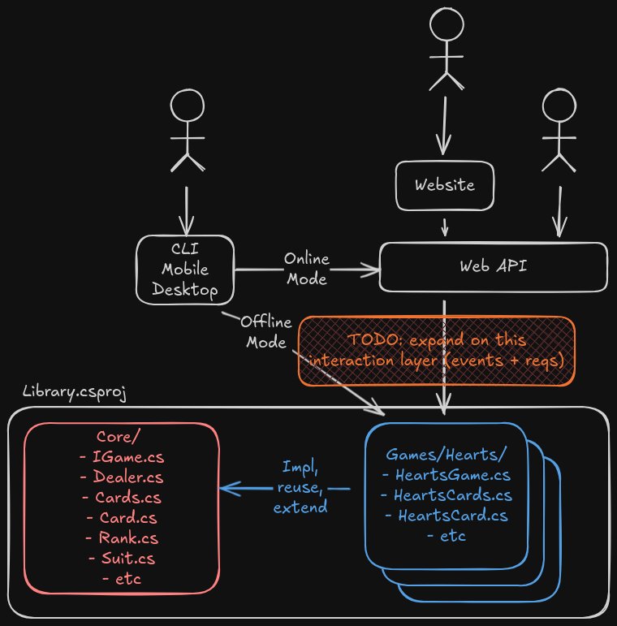
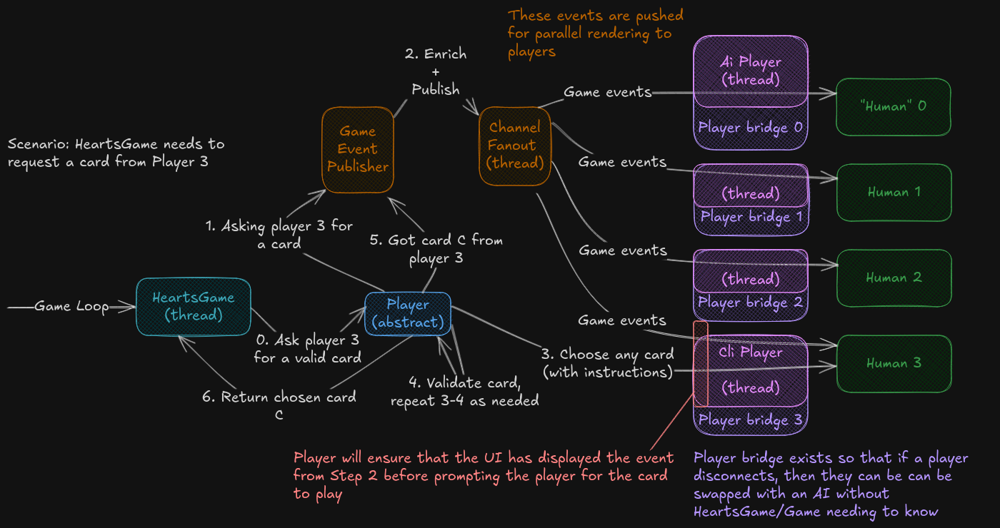
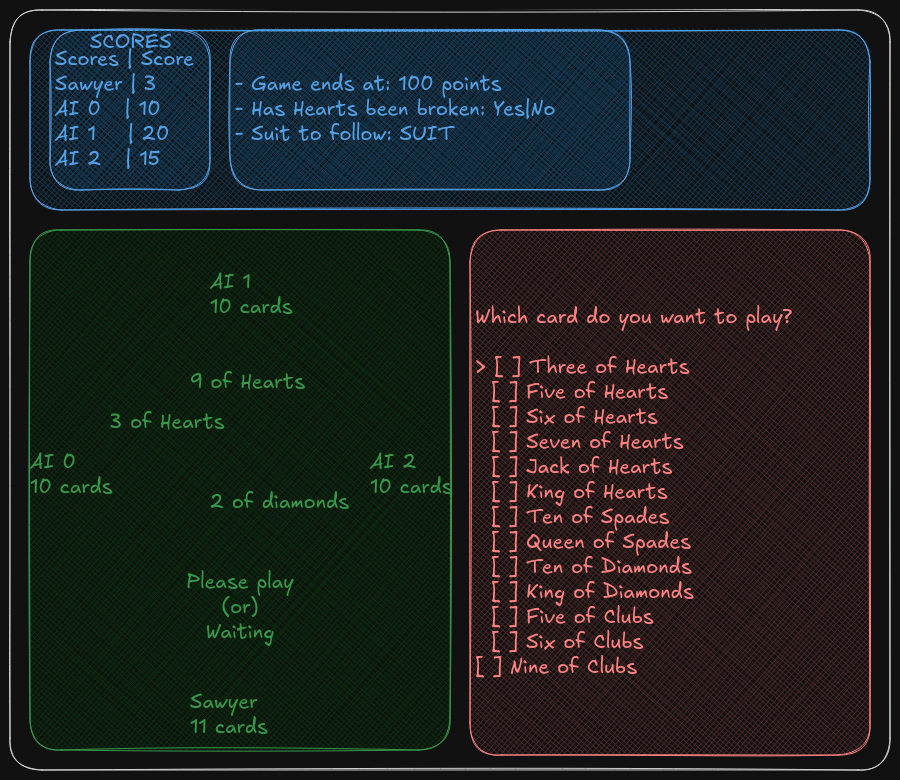

# CoolCardGames

This repository implements a number of card games.

## Getting Started

### Architecture

This uses feature folders and abstract core architecture. Within `Library.csproj`, there is `Core/`,
which contains reusable classes (like `Dealer`), interfaces/abstract classes (likes `Game`), and
classes that can be extended or left as-is (like `Card` and `Cards`). Beyond that, there can/will be
other root directories in `Library.csproj` for other features, like account management n stuff.

Here is the ***planned*** architecture (we'll see how long it takes for me to lose interest):

### High-level data flow within a game instance

Note that unbound channels are used like an event bus.

### Build and Test

`dotnet build`

`dotnet test`

## TODO

Here's the [prototype repo](https://github.com/sawyerwatts/CardGamesPrototype).

### Short-Term

- `HeartsGameFactory` needs to be refactored into a `GameHarness` proxy or similar so that the
  resources can be cleaned up post-game completion
- Update the PlayCard(s) funcs to pass additional, human-readable validation info n actually use
  that in players
- Create `Hand` and `Trick` types (with factories)
    - This way, more events can be pushed automatically, as well as auto-sorting hands
    - Track the playing index with the card(s) played
    - See `DetermineTrickTakerIndexRelativeToStartPlayer` for something to be added
- How handle data visibility to diff players?
- CLI updates
    - Implement CLI wireframe: 
    - Update `Driver` to be more dynamic than just hardcoding hearts stuff
    - support configuring settings, like for the game n cli itself
- Update docs and architecture diagram to better detail interactions (and setup?)
- Misc
    - Decompose `HeartsGame` to be more testable
    - Since `IPlayer` is specific to a specific card type, need to construct one per game, so could
      inject the channel into the player n take a player factory
    - revisit `HeartsGame` and `HeartsGameFactory` and see how they can be reused n cleaned up
    - Unit test `CliPlayer`
    - helpers to prompt for card(s) from many/all players?
- Actually impl `PlayerBridge`
    - Timeout requests probably
    - It'd be slick to refactor `CliPlayer`'s sync logic here (or "in" `IPlayer`)
- Invert the Priority lists to go from highToLow to lowToHigh?

### Other Platforms and Online Mode

- Online mode
    - REST API, maybe [grpc?](https://github.com/grpc/grpc-dotnet)
    - P2P or Server?
    - [Rollback?](https://en.wikipedia.org/wiki/Netcode#Rollback)
    - How handle reconnects? Sticky session, probably
- CLI Online Mode
- Website
- Mobile App, esp w/ offline mode too (LOL)
- Desktop App, esp w/ offline mode too (LOL)

### Other Ideas

- Have a debug mode that lets you see all the other hands and step through running each?
- Meaningful game AI
    - Would need card counting, esp to track when a player runs out of a suit
- Save mid-game
- Seeds and replayability
- Lobbies, queues, chat, notes, passwords, accounts
- Track player stats
- Sufficient logging such that games can be replayed

### Other Card Games to Implement

- Spades
- Rummy
- Chimera (altho this one isn't public domain, so prob just look into the games its based off, ichu,
  The Great Dalmuti, Big Two, and Beat the Landlord)
- Dingbat
- Bridge
- Old Maid
- Go Fish
- Pinochle
- Rummy
- Uno (altho this one isn't public domain, so prob not)
